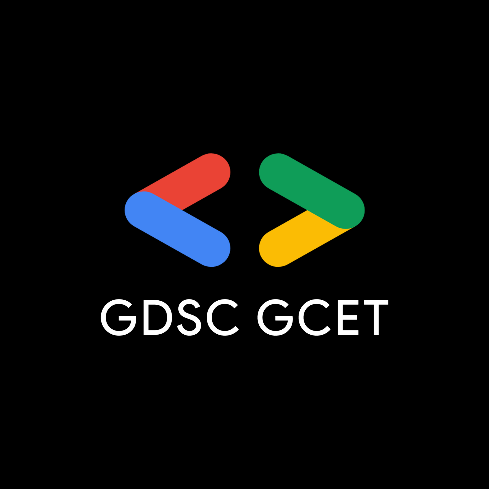

# Welcome to GDSC-GCET 

🤍 Google Developer Student Club - GCET Community 🤍

Aims to facilitate your technological journey and provide tailored learning experience.

We are a dynamic community of tech enthusiasts, innovators, and learners at Galgotia College. 

At GCET-GDSC, we embrace the spirit of curiosity and collaboration to explore the vast world of technology.

# Organisation Head
- Abhinay Goswami ( Github Link - [Abhinay8506](https://github.com/Abhinay8506) )

## What We Offer

- 🤝 **Community Collaboration:** Join a vibrant community passionate about technology.
- 🌐 **Events and Workshops:** Engage in hands-on workshops, tech talks, and collaborative events.
- 🚀 **Project Opportunities:** Contribute to real-world projects and gain practical experience.
- 🌟 **Learning Resources:** Access curated resources to enhance your technical skills.

## Teams and Domains

- Explore our AI/ML projects and contributions in our

  [GDSC AI/ML Repository](https://github.com/orgs/GDSC-GCET/teams/gdsc-ai-ml).

- Explore our APP Development projects and contributions in our

  [GDSC APP Dev Repository](https://github.com/orgs/GDSC-GCET/teams/gdsc-app-development).

- Explore our BlockChain projects and contributions in our

  [GDSC BlockChain Repository](https://github.com/orgs/GDSC-GCET/teams/gdsc-blockchain).

- Explore our Cloud/DevOps projects and contributions in our

  [GDSC Cloud/DevOps Repository](https://github.com/orgs/GDSC-GCET/teams/gdsc-cloud-devops).

- Explore our CyberSecurity projects and contributions in our

  [GDSC CyberSecurity Repository](https://github.com/orgs/GDSC-GCET/teams/gdsc-cybersecurity).

- Explore our DataScience projects and contributions in our

  [GDSC DataScience Repository](https://github.com/orgs/GDSC-GCET/teams/gdsc-datascience).

- Explore our Programming projects and contributions in our

  [GDSC Programming Repository](https://github.com/orgs/GDSC-GCET/teams/gdsc-programming).
  
- Explore our Web Development projects and contributions in our

  [GDSC Web Devlopment Repository](https://github.com/orgs/GDSC-GCET/teams/gdsc-web-development).

## How to Contribute

1. Join our GitHub Organization.
2. Explore the existing projects and repositories.
3. Contribute to ongoing projects or start your own.
4. Engage in discussions and share your knowledge.

## Connect with Us

- [Official Site](https://gdsc.community.dev/galgotias-college-of-engineering-technology-greater-noida/)
- Get Everything at : [LINK](https://linktr.ee/gdscgcet)

Let's code, innovate, and learn together! 🌐✨

